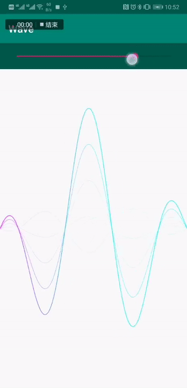
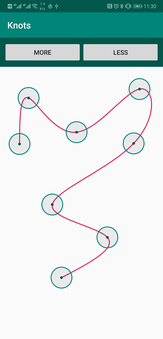

# BezierSpline

[Smooth Bézier Spline Through Prescribed Points](https://www.particleincell.com/2012/bezier-splines/) for Android Platform.

Helps to simulate curves such as `Sine Curve`, `Wave` etc... [Here](https://github.com/xujiaao/BezierSpline/releases/latest) is a Sample Application.





## Usage

Copy [BezierSpline.java](bezier-spline/src/main/java/com/xujiaao/android/bezier/spline/BezierSpline.java) to your project.

````java
private final Path mPath = new Path();
private final Paint mPaint = new Paint();
private final BezierSpline mBezierSpline = new BezierSpline(20);

@Override
protected void onDraw(Canvas canvas) {
    final float width = getWidth();
    final float density = getResources().getDisplayMetrics().density;
    for (int knot = 0, knots = mBezierSpline.knots(); knot < knots; knot++) {
        final float x = knot * (width / (knots - 1F));
        final float y = (float) (Math.toDegrees(Math.sin(Math.toRadians(x / density))) * density);
        mBezierSpline.set(knot, x, y);
    }

    mBezierSpline.applyToPath(mPath);
    canvas.drawPath(mPath, mPaint);
}
````
